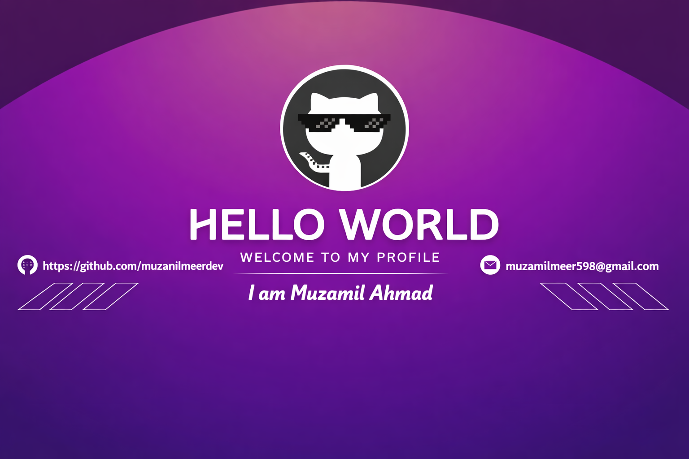

<!--Banner-->

<!--Night Owl image-->

  

<!--Header Name-->
#  ɪ'ᴍ MUZAMIL! 
**
  

<!--Start Intro-->               

A passionate developer | Full-Stack Explorer | Creative UI/UX Craftsman from India.

- I’m currently working on : [Portfolio Website](https://github.com/muzamilmeerdev)

- 🌱 I’m currently learning ***Next.js, Tailwind, GSAP, Three.js, FastAPI**

- 👯 I’m looking to collaborate on [Weather App – Animated UI with GSAP + Live API](https://github.com/muzamilmeerdev//e-commerce)

- 💬 Ask me about **React, GSAP, Tailwind, Three.js, API integrations**

- 📫 How to reach me **muzamilmeerdev@gmail.com**

<!--End Intro-->

<!--Profile Count Badge-->

  

---

<!--Languages and Tools Section-->       
<h2 align="center">Tᴇᴄʜ sᴛᴀᴄᴋ & Lᴀᴛᴇsᴛ ʙʟᴏɢs</h2> 
<picture>
  <source media="(prefers-color-scheme: dark)" srcset="./Skills_Animation_Dark.gif">
  <source media="(prefers-color-scheme: light)" srcset="./Skills_Animation_White.gif">
  
</picture>
 

<h3 align="left">Current Learning</h3>
<ul align="left">
  <li>Deepening my knowledge in GSAP animations and WebGL.</li>
  <li>Exploring advanced React.js patterns and state management techniques.</li>
  <li>Improving my skills in cloud computing with AWS and Azure.</li>
</ul>

<h3 align="left">Latest Blog Posts</h3>
<ul align="left">
  <li><a href="https://muzamilmeerdevblogs.wordpress.com/">🔥latest blogs 🤖</a></li>
  <li><a href="https://dev.to/muzamilmeerdev">🔥DEV.TO profile <1 min🙂</a></li>
</ul>
 
 
 
 

<!--Trophies Section-->   
<h2 align="center">🏆 Gɪᴛʜᴜʙ Tʀᴏᴘʜɪᴇs 🏆</h2>

  <a href="https://github.com/muzamilmeerdev">
    <picture>
      <source media="(prefers-color-scheme: dark)" srcset="https://github-profile-trophy.vercel.app/?username=muzamilmeerdev&no-bg=true&row=2&column=6&margin-w=20&margin-h=20&theme=monokai">
      <source media="(prefers-color-scheme: light)" srcset="https://github-profile-trophy.vercel.app/?username=muzamilmeerdev&no-bg=true&row=2&column=6&margin-w=20&margin-h=20">
      
    </picture>
  </a>

---

<!--Github stats Table--> 
<h2 align="center">📊 Gɪᴛʜᴜʙ Sᴛᴀᴛs 📊</h2>

<table width="100%">
  <tr>
    <td width="50%">
      <h3 align="center"><strong>Gɪᴛʜᴜʙ Sᴛᴀᴛs</strong></h3>
      

        
      

    </td>
    <td width="50%">
      <h3 align="center"><strong>Sᴛʀᴇᴀᴋ Sᴛᴀᴛs</strong></h3>
      

        
      

    </td>
  </tr>
</table>
 

<!--Contact Section--> 
<h2 align="center">🤝 Cᴏɴɴᴇᴄᴛ Wɪᴛʜ Mᴇ 🤝 </h2>

  

 
